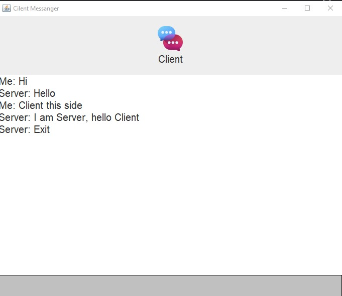

# Java Chat Application

A simple Java-based chat application with GUI built using **Swing** and **Socket Programming**. This project demonstrates client-server communication over TCP and provides a visually interactive chat interface.

---

## 💡 Features

- Real-time two-way chat between server and client.
- Swing-based user-friendly GUI for both client and server.
- Custom UI with:
  - Resizable image icons
  - Rounded input text area
  - Scrollable chat area
- Graceful disconnection with alert dialogs.
- Color-customized input areas and fonts.

---

## 📂 Project Structure

📦ChatApp ┣ 📜 Client.java ┣ 📜 Server.java ┣ 🖼️ chat_logo.png (used in Client) ┣ 🖼️ server.png (used in Server) ┣ 📁 screenshots/ ┣ 🖼️ client-ui.png ┗ 🖼️ server-ui.png ┗ 📜 README.md'


---

## 🚀 Getting Started

### ✅ Prerequisites

- Java JDK 8 or later
- Any Java IDE (e.g., IntelliJ IDEA, Eclipse, VS Code)
- Git (optional, for version control)

---

### 🔧 How to Run

#### ▶️ Run Server
```bash
javac Server.java
java Server
```


#### ▶️ Run Client
```bash
javac Client.java
java Client
```
Ensure the server is running before the client connects.
If running on separate machines, update the IP in Client.java.

### 📸 Screenshots
| Client UI | Server UI |
|-----------|-----------|
|  |  |

### ⚙️ Code Highlights
-BufferedReader and PrintWriter for stream communication.

-Threads for asynchronous reading (real-time chat).

-Key event listener to detect the Enter key (KeyCode 10).

-UI enhancements using LineBorder, ImageIcon, and CompoundBorder.

### 🔮 Future Enhancements
-Multi-client support (using threads or thread pool).

-Add usernames and timestamps.

-Persistent chat logs.

-Emoji and file sharing support.

-Dark/light theme toggle.


🧑‍💻 Author
Priyanath Bhukta
GitHub Profile

